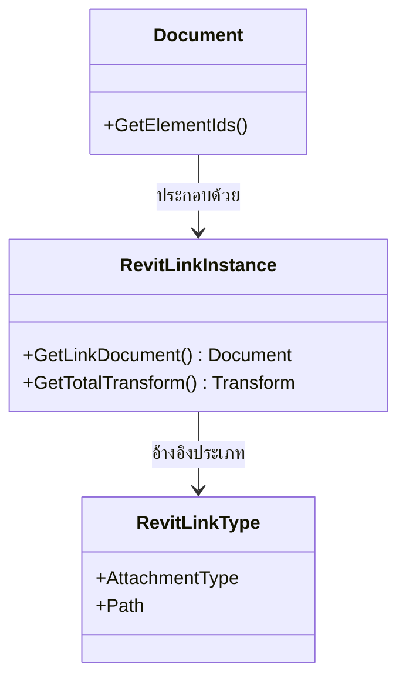

ในการทำโมเดลอาคารจริง คณะทำงานแทบไม่เคยทำงานในไฟล์เดียวจบครับ! โดยทั่วไปแล้วเราจะแบ่งแยกโมเดลออกเป็นหลายไฟล์เพื่อรันงานพร้อมกัน เช่น ไฟล์สถาปัตย์ (Architectural Model), ไฟล์โมเดลโครงสร้าง (Structural Model) และไฟล์งานระบบ (MEP Model) แล้วทำการ **Link ไฟล์** เข้ามาร่วมกัน

ในฐานะนักพัฒนาปลั๊กอินโครงสร้าง ทักษะการ **"เข้าถึงและอ่านข้อมูลข้ามไฟล์ลิงก์"** จึงเป็นความสามารถที่สำคัญที่สุดอย่างหนึ่ง เช่น การอ่านพิกัด Grid Line และเสาสถาปัตย์ เพื่อใช้อ้างอิงการจัดวางเสาและคานโครงสร้าง บทเรียนนี้จะนำพาคุณไปทำความเข้าใจโครงสร้าง API ของ Linked Models ครับ!

---

## 1. โครงสร้างของโมเดลลิงก์ใน Revit

ใน Revit API โมเดลที่ถูกลิงก์เข้ามาจะถูกแทนด้วย Class หลัก 2 ตัว:

1. **`RevitLinkType`**: แทนข้อมูลไฟล์ต้นทาง (Metadata ของลิงก์ เช่น สถานะการโหลด, ที่อยู่ไฟล์พาธบนคอมพิวเตอร์)
2. **`RevitLinkInstance`**: แทนวัตถุที่นำมาจัดวางอยู่ในโมเดลหลักของเรา (เป็นตัวแทนพิกัดใน 3D ของลิงก์นั้น ๆ ในหน้าต่างโปรเจ็กต์ปัจจุบัน)



---

## 2. วิธีเข้าถึง Document ของไฟล์ที่ลิงก์เข้ามา

เมื่อได้วัตถุ `RevitLinkInstance` เราจะสามารถดึง `Document` ของไฟล์นั้นขึ้นมาทำงานเสมือนเป็นโมเดลปกติ โดยใช้เมธอด `.GetLinkDocument()` หลังจากดึงมาได้แล้ว เราจะสามารถใช้ `FilteredElementCollector` ค้นหาชิ้นงานใดๆ ในไฟล์นั้นได้ทันที!

```csharp title="Command.cs — ค้นหาโมเดลลิงก์ทั้งหมด"
using System.Collections.Generic;
using Autodesk.Revit.DB;
using Autodesk.Revit.UI;

namespace RevitToolkit;

public class LinkedModelReader
{
    public void ReadLinkedFiles(Document mainDoc)
    {
        // 1. ค้นหา RevitLinkInstance ทั้งหมดในโมเดลหลัก
        var linkCollector = new FilteredElementCollector(mainDoc)
            .OfClass(typeof(RevitLinkInstance))
            .ToElements();

        foreach (Element elem in linkCollector)
        {
            if (elem is RevitLinkInstance linkInstance)
            {
                // 2. ดึง Document ของไฟล์ลิงก์
                Document linkedDoc = linkInstance.GetLinkDocument();

                if (linkedDoc == null)
                {
                    // ลิงก์นี้อาจจะ Unloaded อยู่ หรือโหลดไม่สำเร็จ
                    continue;
                }

                // 3. แสดงชื่อไฟล์ที่ลิงก์เข้ามา
                string fileName = linkedDoc.Title;
                TaskDialog.Show("โมเดลลิงก์", $"พบไฟล์ลิงก์ชื่อ: {fileName}");
            }
        }
    }
}
```

---

## 3. การแปลงระบบพิกัดข้ามไฟล์ลิงก์ (Coordinate Transformation)

> [!WARNING]
> **นี่คือจุดผิดพลาดที่พบมากที่สุดในหมู่นักเขียนปลั๊กอินมือใหม่!**
> 
> วัตถุในไฟล์ที่ลิงก์เข้ามาจะเก็บพิกัดพิกัดภายในของตัวเองแบบ **Local Coordinates** (เทียบกับจุดศูนย์กลางเดิมของตัวมันเอง) หากไฟล์สถาปัตย์ที่ถูกลิงก์มีการขยับ ย้าย หรือหมุนตัวโมเดล พิกัดที่คุณอ่านจากชิ้นงานโดยตรงจะ **เพี้ยนและผิดไปจากพิกัดโมเดลจริง (Global/Shared Coordinates)** เสมอ!

เพื่อแก้ปัญหานี้ เราต้องดึงค่า Matrix การหมุนและย้ายตำแหน่ง (Transform) ของตัว `RevitLinkInstance` มาคำนวณแปลงพิกัดจุดจาก Local ให้เป็น World Coordinate ในไฟล์หลักของเราเสียก่อนด้วยเมธอด `transform.OfPoint()`

```csharp title="การแปลงพิกัดจุดข้ามไฟล์ลิงก์"
// 1. ดึงค่า Transform ของโมเดลลิงก์ทั้งหมด (ทั้งตำแหน่งและมุมหมุน)
Transform linkTransform = linkInstance.GetTotalTransform();

// 2. สมมติมีจุดพิกัดเสาต้นหนึ่งในไฟล์ลิงก์ (เป็นพิกัด Local ของไฟล์นั้น)
XYZ localPoint = new XYZ(10, 20, 0);

// 3. แปลงจุด Local ไปเป็นพิกัดจริงบนโมเดลหลักของเรา (Global Point)
XYZ globalPoint = linkTransform.OfPoint(localPoint);
```

---

## 4. ตัวอย่างจริง: ตรวจสอบและเปรียบเทียบเสาจากไฟล์ลิงก์สถาปัตย์

ในงานจริง วิศวกรโครงสร้างมักต้องนำพิกัดจุดเสาโครงสร้างในไฟล์ของตน ไปเปรียบเทียบกับพิกัดเสาจากไฟล์สถาปัตย์ที่ลิงก์เข้ามา เพื่อตรวจสอบว่ามีการย้ายพิกัดหนีศูนย์กันหรือไม่ (Column Alignment Check)

ปลั๊กอินด้านล่างนี้จะแสดงการสแกนเสาทั้งหมดจากทุกไฟล์ลิงก์สถาปัตย์ พร้อมทำการแปลงพิกัดเพื่อแสดงผลเป็นพิกัดจริงบนหน้าต่างระบบพิกัดปัจจุบันให้เห็นครับ!

```csharp title="ScanLinkedColumnsCommand.cs"
using System;
using System.Collections.Generic;
using System.Text;
using Autodesk.Revit.Attributes;
using Autodesk.Revit.DB;
using Autodesk.Revit.UI;

namespace RevitToolkit;

[Transaction(TransactionMode.Manual)]
public class ScanLinkedColumnsCommand : IExternalCommand
{
    public Result Execute(ExternalCommandData commandData, ref string message, ElementSet elements)
    {
        Document doc = commandData.Application.ActiveUIDocument.Document;
        var sb = new StringBuilder();

        // 1. ดึงโมเดลลิงก์ทั้งหมด
        var linkInstances = new FilteredElementCollector(doc)
            .OfClass(typeof(RevitLinkInstance))
            .Cast<RevitLinkInstance>();

        int totalLinkedColumns = 0;

        foreach (RevitLinkInstance linkInstance in linkInstances)
        {
            Document linkedDoc = linkInstance.GetLinkDocument();
            
            // ข้ามหากลิงก์ไม่ถูกโหลด
            if (linkedDoc == null) continue;

            sb.AppendLine($"\n📂 ไฟล์ลิงก์: {linkedDoc.Title}");
            
            // ดึง Transform เพื่อใช้แปลงพิกัดจุดเสา
            Transform linkTransform = linkInstance.GetTotalTransform();

            // 2. ค้นหาเสาทั้งหมดในไฟล์ลิงก์นี้
            // ใช้ FilteredElementCollector โดยระบุ Document ของไฟล์ลิงก์!
            var linkedColumns = new FilteredElementCollector(linkedDoc)
                .OfCategory(BuiltInCategory.OST_Columns) // เสาสถาปัตย์
                .WhereElementIsNotElementType()
                .ToElements();

            if (linkedColumns.Count == 0)
            {
                // ถ้าในไฟล์ไม่มีเสาสถาปัตย์ ลองหาเสาโครงสร้างเผื่อไว้
                linkedColumns = new FilteredElementCollector(linkedDoc)
                    .OfCategory(BuiltInCategory.OST_StructuralColumns)
                    .WhereElementIsNotElementType()
                    .ToElements();
            }

            // 3. วนลูปอ่านพิกัดตำแหน่งเสาข้ามลิงก์
            foreach (Element col in linkedColumns)
            {
                if (col.Location is LocationPoint lp)
                {
                    // พิกัดดั้งเดิมในไฟล์ลิงก์ (Local)
                    XYZ localPoint = lp.Point;

                    // แปลงพิกัดเป็นพิกัดจริงในโปรเจ็กต์ปัจจุบันของเรา (Global)
                    XYZ globalPoint = linkTransform.OfPoint(localPoint);

                    // แปลงหน่วยพิกัดเป็นมิลลิเมตรเพื่อการนำเสนอ
                    double xMm = UnitUtils.ConvertFromInternalUnits(globalPoint.X, UnitTypeId.Millimeters);
                    double yMm = UnitUtils.ConvertFromInternalUnits(globalPoint.Y, UnitTypeId.Millimeters);
                    double zMm = UnitUtils.ConvertFromInternalUnits(globalPoint.Z, UnitTypeId.Millimeters);

                    sb.AppendLine($"- [Id: {col.Id}] {col.Name} → พิกัดจริง X: {xMm:F0}, Y: {yMm:F0}, Z: {zMm:F0} มม.");
                    totalLinkedColumns++;
                }
            }
        }

        // แสดงผลลัพธ์
        string header = $"--- ตรวจสอบข้อมูลโมเดลลิงก์ ---\n" +
                        $"พบเสาในไฟล์ลิงก์รวมทั้งสิ้น: {totalLinkedColumns} ต้น\n";
        
        TaskDialog.Show("ตรวจสอบเสาข้ามไฟล์ลิงก์", header + sb.ToString());

        return Result.Succeeded;
    }
}
```

:::note[ข้อจำกัดการเขียนข้อมูลในไฟล์ลิงก์]
พึงระลึกไว้เสมอครับว่า คุณสามารถ **"อ่านข้อมูล"** จาก `linkedDoc` ได้อย่างอิสระ แต่คุณ **"ไม่สามารถแก้ไข ย้ายตำแหน่ง หรือสร้างวัตถุใหม่ลงในโมเดลลิงก์ได้"** หากต้องการเปลี่ยนแปลงแก้ไขข้อมูลไฟล์ลิงก์เหล่านั้นโดยตรง คุณต้องเปิดเขียนโค้ดเปิดไฟล์นั้นแยกต่างหาก (เช่น `app.OpenDocumentFile()`) เท่านั้นครับ
:::
