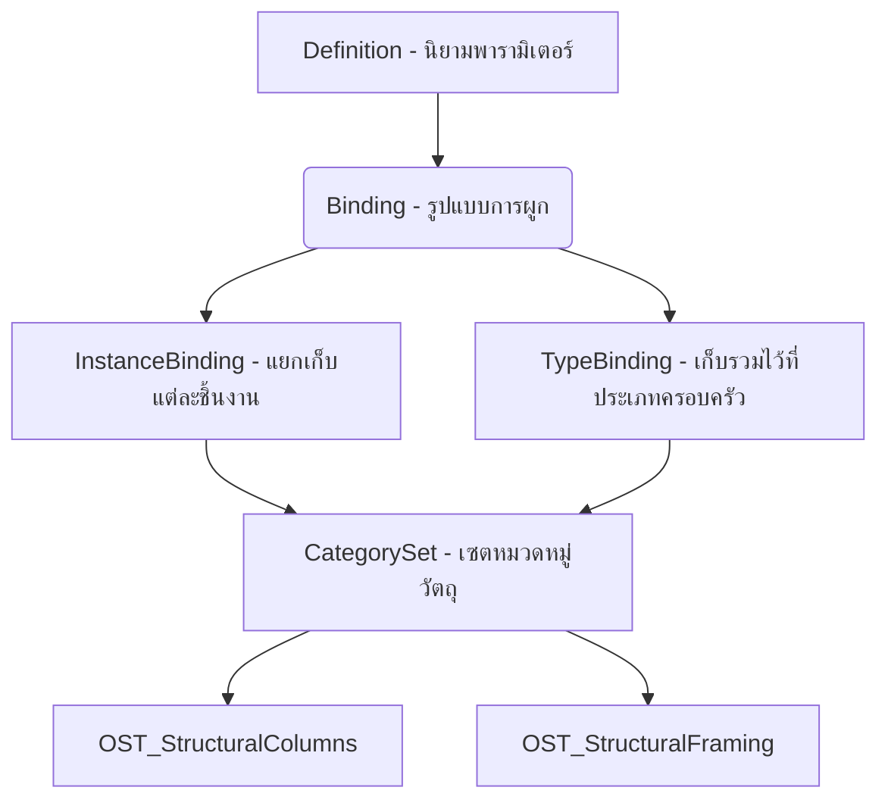

หัวใจสำคัญที่เปลี่ยนจากโมเดล 3D เปล่า ๆ ให้กลายเป็นโมเดล **BIM (Building Information Modeling)** คือ **"ข้อมูล" (Information)** ที่อยู่เบื้องหลังชิ้นส่วนเหล่านั้นครับ 

ในงานวิศวกรรมโครงสร้าง นอกเหนือจากพารามิเตอร์พื้นฐานที่ Revit ให้มา เช่น ความกว้างความลึกของคาน เรามักจำเป็นต้องสร้างพารามิเตอร์เพิ่มเติมขึ้นมาเองเพื่อบันทึกข้อมูลเฉพาะทาง เช่น **ค่ากำลังอัดของคอนกรีต ($f'_c$)**, **เกรดชั้นคุณภาพเหล็กเสริม (SD40, SD50)** หรือ **หมายเหตุการติดตั้ง (Pour Sequence/Zone)**

บทเรียนนี้จะพาคุณไปเจาะลึกวิธีการเขียนโค้ดจัดการข้อมูลเหล่านี้ผ่าน **Project Parameter** และ **Shared Parameter** แบบอัตโนมัติกันครับ!

---

## 1. Project Parameter vs Shared Parameter ต่างกันอย่างไร?

ก่อนลงมือเขียนโค้ด เราต้องเข้าใจสถาปัตยกรรมข้อมูลใน Revit เสียก่อน:

| คุณสมบัติ | Project Parameter | Shared Parameter |
|---|---|---|
| **การทำงาน** | เก็บข้อมูลเฉพาะในโปรเจ็กต์เดียวเท่านั้น | ถูกบันทึกไว้ในไฟล์ข้อมูลกลางแบบข้อความ (`.txt`) สามารถใช้แชร์ข้ามได้หลายโปรเจ็กต์และหลายตระกูล (Families) |
| **การแสดงผลในตาราง** | แสดงผลในตาราง Schedule **ได้** | แสดงผลในตาราง Schedule **ได้** |
| **การนำไปแสดงใน Tag** | **ไม่สามารถ** นำมาโชว์ใน Tag แสดงสัญลักษณ์ (Annotation Tag) ได้ | **สามารถ** นำมาผูกเพื่อแสดงรายละเอียดใน Tag แสดงแบบได้ |
| **โครงสร้างรหัสหลังบ้าน** | ถูกสร้างขึ้นมาโดยโปรแกรมสร้าง ID ใหม่ในเครื่องแบบออนดีมานด์ | มีรหัสสากลเฉพาะตัวคงที่แบบ **GUID (Globally Unique Identifier)** |

> [!IMPORTANT]
> ในระบบการทำงาน BIM ระดับองค์กรส่วนใหญ่ มักจะกำหนดให้ใช้วิธี **"Shared Parameter"** เป็นหลักเสมอ เพราะสามารถส่งต่อไปยัง Tag สัญญลักษณ์ในแบบและป้องกันการกรอกข้อมูลซ้ำซ้อนข้ามหลายโปรเจ็กต์ได้

---

## 2. โครงสร้างการเชื่อมโยงข้อมูล (Parameter Bindings)

ใน Revit API การนำพารามิเตอร์ไปผูกเข้ากับชิ้นงาน จะทำงานผ่าน **`BindingMap`** ซึ่งมีหน้าที่บอกโปรแกรมว่าพารามิเตอร์ชื่อนี้ จะถูกนำไปแปะไว้ในวัตถุหมวดหมู่ (Category) ใดบ้าง และแปะในลักษณะใด:



*   **`InstanceBinding`**: วัตถุแต่ละตัวในโปรเจ็กต์เก็บข้อมูลแยกต่างหากกันได้อิสระ เช่น เสา A มีกำลังอัด 320 ksc ส่วนเสา B มีกำลังอัด 280 ksc
*   **`TypeBinding`**: ชิ้นงานประเภท (Family Type) เดียวกันจะแชร์ค่านี้ร่วมกัน หากเปลี่ยนค่าหนึ่งตัว วัตถุชนิดเดียวกันทั้งหมดจะเปลี่ยนตามทันที

---

## 3. ขั้นตอนการสร้าง Shared Parameter สำหรับงานโครงสร้างผ่านโค้ด

การเขียนโปรแกรมเพื่อสร้าง Shared Parameter มีขั้นตอนหลักดังต่อไปนี้:

1.  เปิดหรือสร้างไฟล์นิยามแบบข้อความ (**Shared Parameter File** `.txt`)
2.  เปิดหรือสร้างกลุ่มหมวดหมู่ภายในไฟล์ (เช่น กลุ่มพารามิเตอร์ชื่อ "Structural_Data")
3.  สร้างนิยามใหม่ (**Definition**) กำหนดชื่อ, ประเภทข้อมูล (เช่น Text, Number, Volume)
4.  เลือกวัตถุที่เราต้องการนำไปแปะ (เช่น เสา คาน ฐานราก) มารวมกันใน **`CategorySet`**
5.  สร้าง **`InstanceBinding`** หรือ **`TypeBinding`** เพื่อกำหนดพฤติกรรมข้อมูล
6.  ผูกข้อมูลเข้ากับระบบเก็บเอกสารปัจจุบันผ่าน **`doc.ParameterBinding.Insert()`**

---

## 4. ตัวอย่างจริง: เครื่องมือ Auto-Create พารามิเตอร์กำลังอัดคอนกรีต (FC')

ลองเขียนปลั๊กอินที่วิศวกรโครงสร้างสามารถใช้รันได้ทันทีเมื่อเปิดไฟล์ใหม่ เพื่อสร้างและผูกพารามิเตอร์ `Concrete_Strength_FC` (สำหรับบันทึกค่า $f'_c$ ของคอนกรีตโครงสร้างหลัก) เข้ากับ เสา คาน และฐานรากโครงสร้างพร้อมๆ กันครับ!

```csharp title="CreateStructuralParameterCommand.cs"
using System;
using System.IO;
using Autodesk.Revit.Attributes;
using Autodesk.Revit.DB;
using Autodesk.Revit.UI;

namespace RevitToolkit;

[Transaction(TransactionMode.Manual)]
public class CreateStructuralParameterCommand : IExternalCommand
{
    public Result Execute(ExternalCommandData commandData, ref string message, ElementSet elements)
    {
        UIApplication uiapp = commandData.Application;
        Document doc = uiapp.ActiveUIDocument.Document;

        // 1. ดึงไฟล์ Shared Parameter ของผู้ใช้ปัจจุบัน
        // หากยังไม่ได้สร้าง เราจะสร้างไฟล์ชั่วคราวขึ้นมาเองบนเครื่อง
        string tempTxtPath = Path.Combine(
            Environment.GetFolderPath(Environment.SpecialFolder.MyDocuments),
            "Revit_Structural_Shared_Parameters.txt"
        );

        if (!File.Exists(tempTxtPath))
        {
            // สร้างไฟล์เปล่าเตรียมไว้
            using (StreamWriter sw = File.CreateText(tempTxtPath)) {}
        }

        // ตั้งค่าให้ Revit เรียกใช้ไฟล์ Shared Parameter ตัวนี้
        uiapp.Application.SharedParametersFilename = tempTxtPath;
        DefinitionFile defFile = uiapp.Application.OpenSharedParameterFile();

        if (defFile == null)
        {
            TaskDialog.Show("เกิดข้อผิดพลาด", "ไม่สามารถเปิดหรือตั้งค่าไฟล์ Shared Parameter ได้");
            return Result.Failed;
        }

        using (Transaction trans = new Transaction(doc, "สร้างพารามิเตอร์ Concrete Strength"))
        {
            trans.Start();

            try
            {
                // 2. ดึงหรือสร้างกลุ่มพารามิเตอร์โครงสร้างในไฟล์ TXT
                string groupName = "Structural_Properties";
                DefinitionGroup defGroup = defFile.Groups.get_Item(groupName) ?? defFile.Groups.Create(groupName);

                // 3. กำหนดนิยามข้อมูลพารามิเตอร์
                // พารามิเตอร์ชื่อ "Concrete_Strength_FC" เก็บข้อมูลประเภทตัวอักษร (Text)
                string paramName = "Concrete_Strength_FC";
                Definition paramDef = defGroup.Definitions.get_Item(paramName);

                if (paramDef == null)
                {
                    // ตั้งค่าคุณสมบัติพารามิเตอร์ (ชื่อ, ชนิดข้อมูล)
                    // Revit 2022+ แนะนำให้ใช้ SpecTypeId ในการระบุประเภทข้อมูลแทน ParameterType เก่า
                    ExternalDefinitionCreationOptions options = new ExternalDefinitionCreationOptions(
                        paramName, 
                        SpecTypeId.String.Text // เก็บข้อมูลตัวอักษร เช่น "C350/400 (400 ksc)"
                    );
                    
                    paramDef = defGroup.Definitions.Create(options);
                }

                // 4. กำหนดกลุ่ม Category โครงสร้างที่เราจะเอานิยามนี้ไปผูก
                CategorySet catSet = uiapp.Application.Create.NewCategorySet();
                
                Category catColumn = doc.Settings.Categories.get_Item(BuiltInCategory.OST_StructuralColumns);
                Category catFraming = doc.Settings.Categories.get_Item(BuiltInCategory.OST_StructuralFraming);
                Category catFoundation = doc.Settings.Categories.get_Item(BuiltInCategory.OST_StructuralFoundation);

                if (catColumn != null) catSet.Insert(catColumn);
                if (catFraming != null) catSet.Insert(catFraming);
                if (catFoundation != null) catSet.Insert(catFoundation);

                // 5. เลือกประเภทการผูกแบบ Instance Binding (แยกบันทึกข้อมูลอิสระในแต่ละชิ้นงาน)
                InstanceBinding instanceBinding = uiapp.Application.Create.NewInstanceBinding(catSet);

                // 6. ผูกข้อมูลเข้ากับโปรเจ็กต์หลัก (ผูกนิยาม, รูปแบบการผูก และให้อยู่ในกลุ่มหมวดหมู่ "Structural Analysis" ใน Property Grid)
                BindingMap bindingMap = doc.ParameterBinding;
                
                // ใช้ GroupTypeId ในการจัดกลุ่มพารามิเตอร์ใน Revit Properties panel (เช่น จัดอยู่ในหมวดวิเคราะห์โครงสร้าง)
                ForgeTypeId groupType = GroupTypeId.StructuralAnalysis;

                bool isBound = bindingMap.Insert(paramDef, instanceBinding, groupType);

                if (isBound)
                {
                    trans.Commit();
                    TaskDialog.Show("สำเร็จ", 
                        $"สร้างและผูกพารามิเตอร์ '{paramName}' เรียบร้อยแล้ว!\n" +
                        $"มีผลกับหมวดหมู่: เสา คาน และฐานรากโครงสร้าง");
                    return Result.Succeeded;
                }
                else
                {
                    trans.RollBack();
                    TaskDialog.Show("แจ้งเตือน", $"พารามิเตอร์ '{paramName}' อาจจะเคยถูกผูกและมีอยู่แล้วในโมเดลนี้");
                    return Result.Cancelled;
                }
            }
            catch (Exception ex)
            {
                trans.RollBack();
                message = ex.Message;
                return Result.Failed;
            }
        }
    }
}
```

---

## 5. วิธีการอ่านและเขียนข้อมูลลงในพารามิเตอร์ที่เพิ่งสร้างขึ้นมา

หลังจากผูกสำเร็จแล้ว หากเราต้องการอ่านหรือเขียนค่าพารามิเตอร์ตัวนี้ให้กับชิ้นงาน สามารถใช้คำสั่งค้นหาพารามิเตอร์ด้วย **"ชื่อระบุโดยตรง"** หรือใช้เมธอดตามตัวอย่างได้ทันทีครับ:

```csharp title="ตัวอย่างการเซ็ตค่า Concrete Strength ให้กับเสา"
using Autodesk.Revit.DB;

public void SetConcreteStrength(Element element, string concreteGradeValue)
{
    // ค้นหาพารามิเตอร์จากชื่อที่เราตั้งไว้
    Parameter concreteParam = element.LookupParameter("Concrete_Strength_FC");

    if (concreteParam != null && !concreteParam.IsReadOnly)
    {
        // ทำการเขียนข้อมูลค่าใหม่ลงไป (กรณีข้อมูลชนิด String)
        concreteParam.Set(concreteGradeValue); // เช่น "SD40", "C350"
    }
}
```

:::warning[คำเตือนสำคัญในระบบโปรเจ็กต์จริง]
ในความเป็นจริง การเรียกหาพารามิเตอร์โดยพิมพ์ **"ข้อความชื่อโดยตรง"** เช่น `LookupParameter("Concrete_Strength_FC")` อาจก่อให้เกิดความผิดพลาดได้ง่าย หากมีผู้อื่นพิมพ์ตัวอักษรใหญ่เล็กผิดพลาดหรือสร้างพารามิเตอร์ชื่อซ้ำซ้อนกัน

แนวทางปฏิบัติที่ดีที่สุดสำหรับ Shared Parameter คือ **การค้นหาและเข้าถึงข้อมูลผ่านรหัส GUID** ของพารามิเตอร์นั้น ๆ เสมอ:

```csharp
// ดึงพารามิเตอร์ด้วย GUID เพื่อป้องกันปัญหาชื่อทับซ้อนและเขียนผิด
Guid concreteParamGuid = new Guid("xxxx-xxxx-xxxx-xxxx"); // รหัสเฉพาะตัวจากไฟล์ Shared Parameter ขององค์กร
Parameter safeParam = element.get_Parameter(concreteParamGuid);
```
:::
